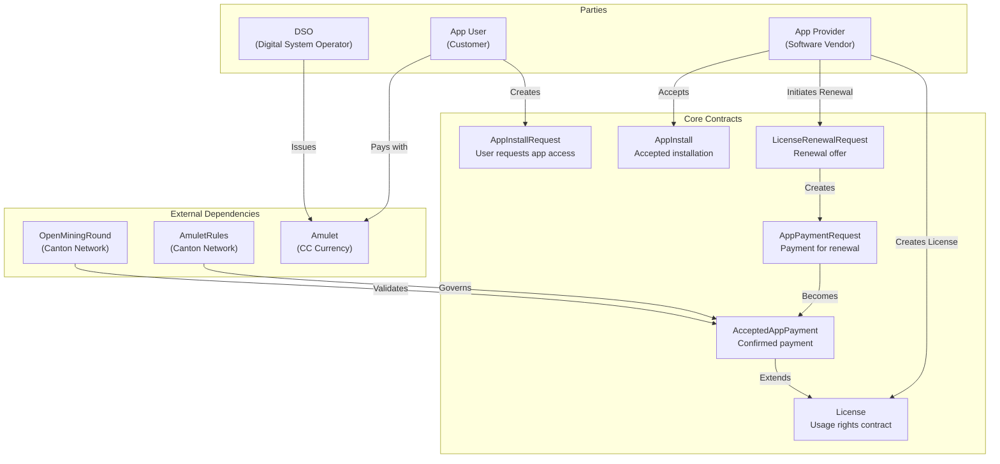
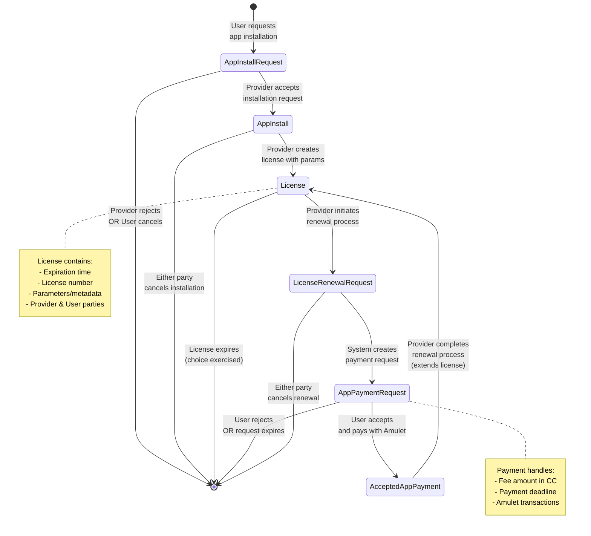
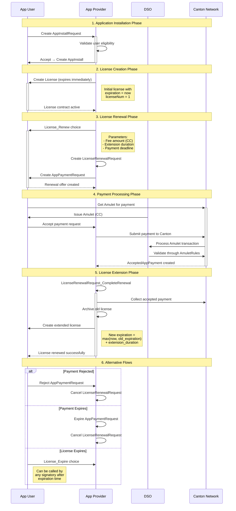
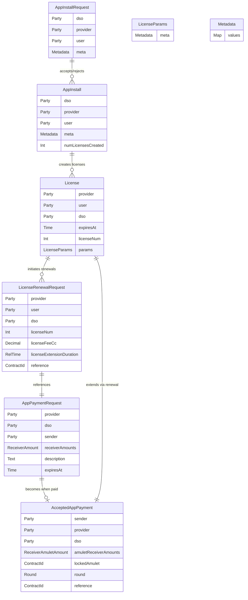

# Canton Network Licensing System Workflow

## Overview

The Canton Network Licensing System is a DAML-based application that manages software licenses between app providers and app users within the Canton Network ecosystem. It handles application installations, license creation, renewals, and lifecycle management using Amulet (CC) cryptocurrency for payments.

## System Architecture

### Key Parties

- **DSO (Digital System Operator)**: Issues Amulet currency and manages Canton Network rules
- **App Provider**: Software vendor offering licensed applications  
- **App User**: Customer purchasing licenses to use the applications

### Core Components

1. **[License.daml](daml/Licensing/License.daml)** - Core licensing contract with renewal and expiration logic
2. **[AppInstall.daml](daml/Licensing/AppInstall.daml)** - Application installation and user onboarding management  
3. **[Util.daml](daml/Licensing/Util.daml)** - Utility functions for metadata validation and assertions

## System Overview Diagram



## Contract State Diagram



## Detailed Workflow Sequence



## Data Model



## Workflow Details

### 1. Application Installation Phase

**User Onboarding Process:**

1. **User Request**: User creates `AppInstallRequest` with metadata for system correlation
2. **Provider Validation**: Provider validates user eligibility and existing installations
3. **Installation Creation**: Provider accepts request → creates `AppInstall` contract
4. **Tracking**: `AppInstall` tracks `numLicensesCreated` for each user

**Key Features:**
- Either party can cancel installation at any time
- Metadata supports integration with external systems
- Provider can associate internal user IDs with installations

**Code Example:**
```daml
-- User submits install request
requestId <- submit user.primaryParty do
  createCmd AppInstallRequest with
    dso = app.dso
    provider = app.provider.primaryParty
    user = user.primaryParty
    meta = emptyMetadata

-- Provider accepts request
submit app.provider.primaryParty do
  exerciseCmd requestId AppInstallRequest_Accept with
    meta = emptyMetadata
    installMeta = Metadata with
      values = Map.fromList [("providerUserId", "<user-id>")]
```

### 2. License Creation and Management

**License Contract Structure:**

- `expiresAt`: License expiration timestamp
- `licenseNum`: Sequential identifier for user's licenses  
- `params`: Configurable metadata for license purpose/restrictions
- Signed by both provider and user

**Initial License Creation:**
```daml
-- Provider creates initial license that expires immediately
result <- exerciseCmd installId AppInstall_CreateLicense with
  params = LicenseParams with
    meta = Metadata with
      values = Map.fromList [("licenseId", "<dummy-uuid>")]

-- License is created with expiresAt = now, forcing immediate renewal
```

### 3. License Renewal Process

**Step-by-Step Renewal:**

#### 3.1 Renewal Initiation (Provider)
- Provider exercises `License_Renew` choice
- Specifies fee amount, extension duration, payment deadline
- Creates both `LicenseRenewalRequest` and `AppPaymentRequest`

```daml
(renewalRequest, paymentRequest) <- submit provider.primaryParty do
  exerciseCmd licenseId License_Renew with
    licenseFeeCc = 20.0
    licenseExtensionDuration = days 365
    paymentAcceptanceDuration = days 1
    description = "Annual license renewal"
```

#### 3.2 Payment Processing (User)
- User obtains Amulet (CC) from DSO
- User accepts payment request with sufficient Amulet
- Canton Network processes payment through AmuletRules
- Creates `AcceptedAppPayment` contract

#### 3.3 License Extension (Provider)
- Provider exercises `LicenseRenewalRequest_CompleteRenewal`
- System validates payment matches renewal terms
- Archives old license, creates new license with extended expiration

```daml
-- Extension calculation
expiresAt = (max now license.expiresAt) `addRelTime` licenseExtensionDuration
```

### 4. Alternative Scenarios

#### Payment Rejection
- User can reject payment request using `AppPaymentRequest_Reject`
- Provider cancels renewal request with metadata reason
- Both contracts archived, license remains unchanged

#### Payment Expiration
- Provider can expire payment requests past deadline using `AppPaymentRequest_Expire`
- Automatic cleanup of renewal and payment contracts
- Balances remain unchanged

#### License Expiration
- Any signatory can expire license after expiration time using `License_Expire`
- Explicit cleanup mechanism for expired licenses

## Testing Scenarios

The comprehensive test suite in `../licensing-tests/daml/Licensing/Scripts/TestLicense.daml` demonstrates:

```mermaid
flowchart TD
    Start([Test Scenario Starts]) --> Setup[Setup Licensing App<br/>Provider, Alice, Bob, DSO]
    Setup --> Install[Alice requests App Installation<br/>Provider accepts]
    Install --> InitLicense[Provider creates initial License<br/>expiresAt = now]
    
    InitLicense --> Time1[Advance 10 days<br/>2022-01-11]
    Time1 --> Renewal1[First Renewal: $20 USD<br/>Extension: 365 days]
    Renewal1 --> Pay1[Alice pays with 64 CC<br/>Provider receives payment]
    Pay1 --> Check1[Verify: License expires 2023-01-11<br/>Provider: $220, Alice: $45]
    
    Check1 --> Time2[Advance 171 days<br/>2022-07-01 - Midyear Sale]
    Time2 --> Renewal2A[Second Renewal A: $10 USD<br/>Extension: 365 days]
    Renewal2A --> Renewal2B[Concurrent Renewal B: $10 USD<br/>Extension: 366 days]
    Renewal2B --> Pay2[Alice pays both renewals<br/>Provider receives payments]
    Pay2 --> Check2[Verify: License expires 2025-01-11<br/>Provider: $240, Alice: $65]
    
    Check2 --> Time3[Advance 183 days<br/>2022-12-31 - Year End Sale]
    Time3 --> Renewal3[Third Renewal: $10 USD<br/>Extension: 365 days]
    Renewal3 --> Reject[Alice REJECTS payment<br/>Provider cancels renewal]
    Reject --> Check3[Verify: No payment processed<br/>Balances unchanged]
    
    Check3 --> Renewal4[Fourth Renewal: $10 USD<br/>Extension: 365 days]
    Renewal4 --> Time4[Advance 10 days<br/>Payment request EXPIRES]
    Time4 --> Expire[Provider expires payment<br/>Cancels renewal request]
    Expire --> Check4[Verify: No contracts remain<br/>Balances unchanged]
    
    Check4 --> End([Test Complete])
    
    style Renewal1 fill:#e1f5fe
    style Renewal2A fill:#e8f5e8
    style Renewal2B fill:#e8f5e8
    style Renewal3 fill:#ffebee
    style Renewal4 fill:#fff3e0
    style Pay1 fill:#e1f5fe
    style Pay2 fill:#e8f5e8
    style Reject fill:#ffebee
    style Expire fill:#fff3e0
```



### Test Scenarios Covered

1. **Successful Renewal**: $20 fee, 1-year extension
2. **Concurrent Renewals**: Multiple extensions during sale periods  
3. **Payment Rejection**: User declines renewal payment
4. **Payment Expiration**: Timeout handling for expired requests

**Financial Tracking:**
- Provider balance increases with successful payments
- User balance decreases by payment amounts + transaction fees
- Failed renewals don't affect balances

## Key Design Features

### Metadata System
- Flexible key-value metadata for integration
- Size limits: max 128 entries, 8192 total characters
- Used for correlation with external systems

```daml
-- Metadata validation
enforceMetadataLimits : Metadata -> Update ()
enforceMetadataLimits (Metadata m) = do
  let numEntries = Map.size m
  unless (numEntries <= 128) $ 
    fail $ "Metadata has too many entries " <> show numEntries <> ": max 128"
  let totalSize = sum [T.length k + T.length v | (k, v) <- Map.toList m]
  unless (totalSize <= 8192) $ 
    fail $ "Metadata is too large " <> show totalSize <> ": max 8192 chars"
```

### Payment Integration
- Native Amulet (CC) payment support
- Integration with Canton Network's payment infrastructure
- Automatic handling of mining rounds and transfer contexts

### Concurrency Support
- Multiple renewal requests can be active simultaneously
- Each renewal is independent with separate payment flows
- License extensions accumulate additively

### Error Handling
- Comprehensive validation of payment amounts and timing
- Graceful handling of expired or rejected payments
- Metadata validation with clear error messages

```daml
-- Example validation
require "Actor is a signatory" (actor `elem` signatory this)
require "License is not expired yet" (now > expiresAt)
```

## Dependencies

The licensing system depends on several Canton Network components:

- **splice-amulet-0.1.9.dar**: Amulet currency and payment infrastructure
- **splice-util-0.1.3.dar**: Utility functions and common types
- **splice-wallet-payments-0.1.9.dar**: Payment processing and wallet integration

## Conclusion

This licensing system provides a robust, blockchain-based solution for software licensing with cryptocurrency payments. It demonstrates enterprise-grade features including:

- **Decentralized Trust**: Smart contracts ensure transparent, tamper-proof licensing
- **Flexible Payments**: Native cryptocurrency integration with automatic processing
- **Metadata Integration**: Support for external system correlation and business logic
- **Concurrent Operations**: Multiple renewals and complex business scenarios
- **Comprehensive Testing**: Full test coverage of success and failure scenarios

The system is designed for production use in the Canton Network ecosystem, providing a foundation for SaaS applications to implement blockchain-based licensing with confidence. 