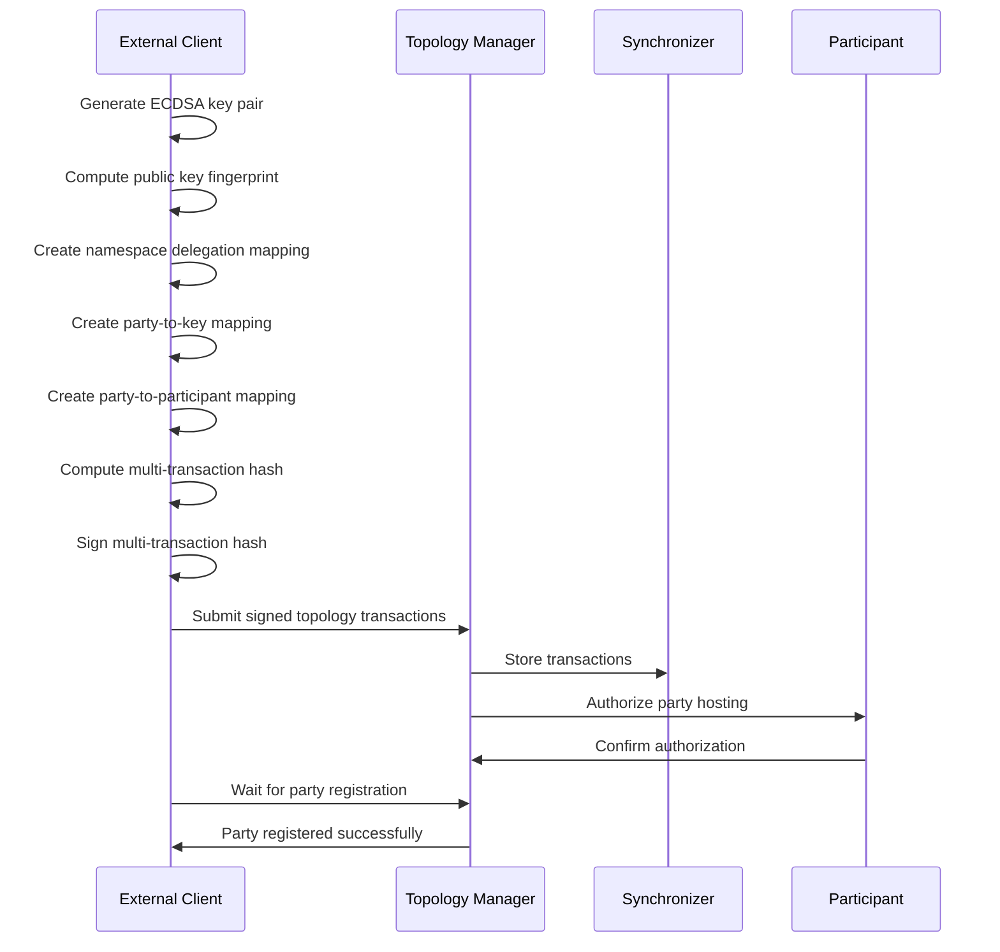
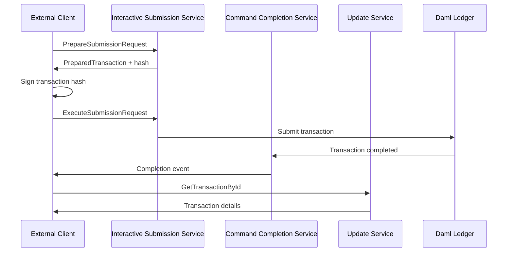
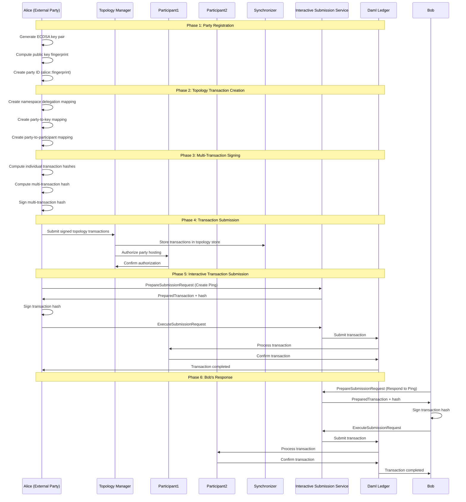

# External User Onboarding Workflow in Canton

## Overview

The external user onboarding workflow in Canton enables external parties to participate in the distributed ledger without requiring direct access to participant nodes. This workflow demonstrates how to onboard external users who can then submit transactions through the Interactive Submission Service using external signing.

## Understanding Canton Topology

### What is Topology in Canton?

**Topology** in Canton refers to the complete network structure and configuration that defines how different components interact within a distributed ledger network. It's essentially the "map" of the entire Canton network that describes:

1. **Network Participants**: Who can participate in the network
2. **Identity Management**: How identities are established and verified
3. **Permission Structures**: What each participant can do
4. **Trust Relationships**: How trust is established between network components
5. **Key Management**: How cryptographic keys are distributed and used

### Topology Components

The Canton topology consists of several key components:

#### 1. **Synchronizers (Domains)**

- **Purpose**: Logical groupings of network participants that share a common ordering and consensus mechanism
- **Components**: Contains sequencers, mediators, and participants
- **Function**: Provides the infrastructure for transaction ordering and conflict resolution

#### 2. **Sequencers**

- **Purpose**: Order transactions within a synchronizer
- **Function**: Ensures all participants see transactions in the same order
- **Topology Role**: Defined in `SequencerSynchronizerState` mappings

#### 3. **Mediators**

- **Purpose**: Resolve conflicts and ensure transaction consistency
- **Function**: Handle transaction confirmation and validation
- **Topology Role**: Defined in `MediatorSynchronizerState` mappings

#### 4. **Participants**

- **Purpose**: Host parties and execute Daml contracts
- **Function**: Process transactions and maintain contract state
- **Topology Role**: Defined through various participant-related mappings

#### 5. **Parties**

- **Purpose**: Represent entities that can own and interact with contracts
- **Function**: Sign transactions and exercise contract choices
- **Topology Role**: Defined through `PartyToParticipant` and `PartyToKeyMapping`

### Topology Mappings

Topology mappings are the fundamental building blocks that define relationships and permissions in the network:

#### Core Mapping Types

1. **Namespace Delegation** (`NamespaceDelegation`)
   - **Purpose**: Establishes trust hierarchies and delegation chains
   - **Function**: Similar to X.509 certificate authorities in traditional PKI
   - **Usage**: Defines who can sign for which namespace

2. **Party-to-Key Mapping** (`PartyToKeyMapping`)
   - **Purpose**: Associates parties with their signing keys
   - **Function**: Enables external signing for transaction authorization
   - **Usage**: Maps party IDs to cryptographic public keys

3. **Party-to-Participant Mapping** (`PartyToParticipant`)
   - **Purpose**: Defines which participants host which parties
   - **Function**: Establishes hosting relationships and permissions
   - **Usage**: Determines where parties are hosted and their confirmation rights

4. **Owner-to-Key Mapping** (`OwnerToKeyMapping`)
   - **Purpose**: Associates network components (participants, mediators, sequencers) with their keys
   - **Function**: Enables component authentication and authorization
   - **Usage**: Maps component IDs to their cryptographic identities

5. **Synchronizer Trust Certificate** (`SynchronizerTrustCertificate`)
   - **Purpose**: Establishes trust relationships between participants and synchronizers
   - **Function**: Defines which participants trust which synchronizers
   - **Usage**: Creates the trust foundation for cross-synchronizer communication

### Topology Transaction Processing

Topology changes are processed through a sophisticated transaction system:

#### Transaction Lifecycle

1. **Creation**: Topology mappings are created and serialized
2. **Signing**: Transactions are signed by authorized parties
3. **Submission**: Signed transactions are submitted to the topology manager
4. **Validation**: Transactions are validated against existing topology state
5. **Activation**: Valid transactions become active at a specific effective time
6. **Propagation**: Changes are propagated to all network participants

#### Authorization Model

Topology transactions require proper authorization:

- **Namespace Authorization**: Changes must be signed by keys authorized for the relevant namespace
- **Multi-Signature Support**: Some operations require multiple signatures (threshold-based)
- **Delegation Chains**: Authorization can be delegated through namespace delegation mappings
- **Time-Based Activation**: Changes become effective at specific timestamps

### Topology in External User Onboarding

In the context of external user onboarding, topology serves several critical functions:

#### 1. **Identity Establishment**

- Creates the party's namespace through namespace delegation
- Establishes the party's cryptographic identity
- Defines the party's unique identifier in the network

#### 2. **Permission Definition**

- Maps the party to their signing keys
- Defines which participants can host the party
- Establishes confirmation and observation permissions

#### 3. **Trust Relationships**

- Creates trust relationships between the external party and hosting participants
- Establishes the party's authority to sign transactions
- Defines the scope of the party's operations

#### 4. **Network Integration**

- Integrates the external party into the existing network topology
- Ensures the party can participate in transactions
- Establishes the party's visibility to other network participants

## Architecture Components

### Key Components

1. **Interactive Submission Service**: Allows external parties to submit transactions with external signatures
2. **Topology Manager**: Manages network topology including party registrations and key mappings
3. **External Party Onboarding**: Process for registering external parties with the network
4. **Ping Template**: Simple Daml contract used to demonstrate the workflow

### Files Involved

- [interactive_submission.py](https://github.com/hyperledger-labs/splice/blob/main/canton/community/app/src/pack/examples/08-interactive-submission/interactive_submission.py): Main demo script
- [external_party_onboarding.py](https://github.com/hyperledger-labs/splice/blob/main/canton/community/app/src/pack/examples/08-interactive-submission/external_party_onboarding.py): External party registration logic
- [interactive_topology_util.py](https://github.com/hyperledger-labs/splice/blob/main/canton/community/app/src/pack/examples/08-interactive-submission/interactive_topology_util.py): Utility functions for topology operations
- [Ping.daml](https://github.com/hyperledger-labs/splice/blob/main/canton/community/participant/src/main/daml/AdminWorkflows/Canton/Internal/Ping.daml): Demo contract template

## Workflow Overview

The external user onboarding workflow consists of three main phases:

1. **Party Registration**: Creating and registering external parties with the network
2. **Key Management**: Generating and registering cryptographic keys for transaction signing
3. **Transaction Demonstration**: Demonstrating external transaction submission using the Ping contract

## Detailed Workflow Steps

### Phase 1: Party Registration

#### Step 1: Generate Cryptographic Key Pair

```python
# Generate ECDSA key pair using SECP256R1 curve
private_key = ec.generate_private_key(curve=ec.SECP256R1())
public_key = private_key.public_key()

# Export public key in DER format
public_key_bytes = public_key.public_bytes(
    encoding=serialization.Encoding.DER,
    format=serialization.PublicFormat.SubjectPublicKeyInfo,
)
```

#### Step 2: Compute Public Key Fingerprint

```python
# Compute Canton-compatible fingerprint using SHA-256 with purpose 12
public_key_fingerprint = compute_fingerprint(public_key_bytes)
```

The fingerprint computation uses Canton's specific hashing scheme:

- **Purpose**: 12 (PublicKeyFingerprint)
- **Algorithm**: SHA-256
- **Format**: Multi-hash encoding with SHA-256 prefix

#### Step 3: Construct Party ID

```python
# Party ID format: party_name::fingerprint
party_id = party_name + "::" + public_key_fingerprint
```

### Phase 2: Topology Transaction Creation

The onboarding process requires three topology transactions to be submitted atomically. These transactions establish the party's identity, permissions, and network relationships within the Canton topology:

#### Transaction 1: Namespace Delegation

```python
namespace_delegation_mapping = topology_pb2.TopologyMapping(
    namespace_delegation=topology_pb2.NamespaceDelegation(
        namespace=public_key_fingerprint,
        target_key=signing_public_key,
        is_root_delegation=True,
    )
)
```

**Purpose**: Establishes the party's namespace and root delegation authority.

**Topology Impact**:

- Creates a new namespace identified by the party's public key fingerprint
- Establishes the party as the root authority for this namespace
- Enables the party to sign topology transactions within their namespace
- Similar to creating a root certificate authority in traditional PKI systems

#### Transaction 2: Party-to-Key Mapping

```python
party_to_key_mapping = topology_pb2.TopologyMapping(
    party_to_key_mapping=topology_pb2.PartyToKeyMapping(
        party=party_id,
        threshold=1,
        signing_keys=[signing_public_key],
    )
)
```

**Purpose**: Associates the party with their signing key for transaction authorization.

**Topology Impact**:

- Maps the party ID to their cryptographic signing key
- Enables external signing for Daml transactions
- Establishes the party's authority to sign transactions on their own behalf
- Supports threshold-based signing (multiple keys can be registered)
- Critical for the Interactive Submission Service to verify transaction signatures

#### Transaction 3: Party-to-Participant Mapping

```python
party_to_participant_mapping = topology_pb2.TopologyMapping(
    party_to_participant=topology_pb2.PartyToParticipant(
        party=party_id,
        threshold=confirming_threshold,
        participants=confirming_participants_hosting,
    )
)
```

**Purpose**: Defines which participants host the party and their confirmation permissions.

**Topology Impact**:

- Establishes which participants will host the party
- Defines the party's confirmation threshold (how many participants must confirm transactions)
- Sets participant permissions (confirmation vs. observation)
- Enables the party to participate in transactions on the network
- Creates the hosting relationship between the party and participant nodes
- Determines transaction routing and confirmation requirements

### Phase 3: Multi-Transaction Signing

The three topology transactions must be signed atomically to ensure consistency. This prevents partial state changes that could leave the party in an inconsistent state.

#### Step 1: Compute Individual Transaction Hashes

```python
# Hash each topology transaction with purpose 11
namespace_transaction_hash 
  = compute_sha256_canton_hash(11, namespace_delegation_transaction)

party_to_key_transaction_hash 
  = compute_sha256_canton_hash(11, party_to_key_transaction)

party_to_participant_transaction_hash 
  = compute_sha256_canton_hash(11, party_to_participant_transaction)
```

**Topology Significance**: Each transaction is hashed with purpose 11 (TopologyTransactionSignature), which is Canton's specific hash purpose for topology transaction signatures.

#### Step 2: Compute Multi-Transaction Hash

```python
# Combine all transaction hashes with purpose 55
multi_hash = compute_multi_transaction_hash([
    namespace_transaction_hash,
    party_to_key_transaction_hash,
    party_to_participant_transaction_hash,
])
```

**Topology Significance**:

- Purpose 55 (MultiTopologyTransactionSignature) ensures atomic signing of multiple related topology changes
- Prevents partial state updates that could create inconsistent topology states
- Ensures all three transactions are either all applied or none applied

#### Step 3: Sign Multi-Transaction Hash

```python
# Sign using ECDSA with SHA-256
signature = sign_hash(private_key, multi_hash)
```

**Topology Significance**: The signature authorizes all three topology changes as a single atomic operation, ensuring the party's complete integration into the network topology.

### Phase 4: Transaction Submission

Once the topology transactions are signed, they must be submitted to the topology manager and authorized by the hosting participants.

#### Step 1: Build Signed Transactions

```python
signed_namespace_transaction = build_signed_topology_transaction(
    namespace_delegation_transaction, 
    hash_list, 
    signature, 
    public_key_fingerprint
)
```

**Topology Impact**: Creates signed topology transactions that can be validated and processed by the topology manager.

#### Step 2: Submit to Topology Manager

```python
add_transactions_request = topology_manager_write_service_pb2.AddTransactionsRequest(
    transactions=[
        signed_namespace_transaction,
        signed_party_to_key_transaction,
        signed_party_to_participant_transaction,
    ],
    store=common_pb2.StoreId(synchronizer=common_pb2
      .StoreId.Synchronizer(id=synchronizer_id)),
)
topology_write_client.AddTransactions(add_transactions_request)
```

**Topology Impact**:

- Submits all three topology transactions to the topology manager
- Transactions are stored in the synchronizer's topology store
- Triggers the topology transaction processing pipeline
- Begins the process of integrating the party into the network topology

#### Step 3: Authorize Hosting

```python
topology_write_client.Authorize(
    topology_manager_write_service_pb2.AuthorizeRequest(
        proposal=topology_manager_write_service_pb2.AuthorizeRequest.Proposal(
            change=topology_pb2.Enums.TopologyChangeOp.TOPOLOGY_CHANGE_OP_ADD_REPLACE,
            serial=1,
            mapping=party_to_participant_mapping,
        ),
        must_fully_authorize=False,
        store=common_pb2.StoreId(synchronizer=common_pb2
          .StoreId.Synchronizer(id=synchronizer_id)),
    )
)
```

**Topology Impact**:

- Authorizes the party-to-participant mapping from the hosting participant's perspective
- Establishes the participant's agreement to host the party
- Completes the mutual trust relationship between party and participant
- Enables the party to start participating in transactions

## Interactive Transaction Submission Workflow

### Ping Contract Template

The demo uses a simple Ping contract:

```daml
template Ping
  with
    id : Text
    initiator : Party    
    responder : Party
  where
    signatory initiator
    observer responder

    choice Respond : ()
      controller responder
        do
          return ()

    choice AbortPing : ()
      with
        anyone : Party
      controller anyone
        do
          return ()
```

### Transaction Submission Process

#### Step 1: Prepare Transaction

```python
prepare_create_request = interactive_submission_service_pb2
  .PrepareSubmissionRequest(
      user_id=user_id,
      command_id=str(uuid.uuid4()),
      act_as=[initiator],
      read_as=[initiator],
      synchronizer_id=synchronizer_id,
      commands=[ping_create_command],
  )
prepare_create_response = iss_client.PrepareSubmission(prepare_create_request)
```

#### Step 2: Compute Transaction Hash

```python
transaction_hash = encode_prepared_transaction(
    prepared_transaction, 
    create_nodes_dict(prepared_transaction)
)
```

#### Step 3: Sign Transaction

```python
signature = party_private_key.sign(
    transaction_hash, 
    signature_algorithm=ec.ECDSA(hashes.SHA256())
)
```

#### Step 4: Execute Transaction

```python
execute_request = interactive_submission_service_pb2.ExecuteSubmissionRequest(
    prepared_transaction=prepared_transaction,
    user_id=user_id,
    party_signatures=interactive_submission_service_pb2.PartySignatures(
        signatures=[
            interactive_submission_service_pb2.SinglePartySignatures(
                party=party,
                signatures=[
                    interactive_submission_service_pb2.Signature(
                        format=interactive_submission_service_pb2
                        .SignatureFormat
                        .SIGNATURE_FORMAT_RAW,
                        signature=signature,
                        signed_by=pub_fingerprint,
                        signing_algorithm_spec=interactive_submission_service_pb2
                        .SigningAlgorithmSpec
                        .SIGNING_ALGORITHM_SPEC_EC_DSA_SHA_256,
                    )
                ],
            )
        ]
    ),
    hashing_scheme_version=HASHING_SCHEME_VERSION_V2,
    submission_id=str(uuid.uuid4()),
)
iss_client.ExecuteSubmission(execute_request)
```

## Topology Mappings Diagram

### Topology Overview

The following diagram illustrates the topology mappings created during external user onboarding in Canton. The topology defines the network structure, identity relationships, and permission hierarchies that enable external parties to participate in the distributed ledger.

### Topology Mappings Structure


### Diagram Legend

- **🔴 External Parties** (Red): Alice and Bob - External users who are being onboarded
- **🔵 Participant Nodes** (Blue): Participant1 and Participant2 - Host parties and execute contracts
- **🟠 Synchronizer** (Orange): Domain that provides ordering and consensus
- **🟢 Topology Mappings** (Green): Define relationships and permissions
- **🟣 Cryptographic Keys** (Purple): ECDSA key pairs for signing and verification
- **🟢 Contract** (Teal): Ping contract demonstrating the workflow

### Key Relationships

1. **Identity Chain**: External Party → Cryptographic Key → Namespace Delegation
2. **Authorization Chain**: Party → Key Mapping → Transaction Signing Authority
3. **Hosting Chain**: Party → Participant Mapping → Network Participation
4. **Trust Chain**: Participant → Synchronizer → Network Consensus

## Sequence Diagrams

### External Party Onboarding Sequence



### Interactive Transaction Submission Sequence



### Complete Transaction Flow



## Security Considerations

### Key Management

- **Single Key Usage**: The demo uses one key for both namespace operations and transaction signing
- **Production Recommendation**: Use separate keys for namespace management and transaction signing
- **Key Storage**: Private keys should be stored securely in production environments

### Transaction Validation

- **User Validation**: The demo includes transaction inspection before signing
- **Hash Verification**: All transaction hashes are computed using Canton's specific hashing scheme
- **Multi-Transaction Atomicity**: Related topology transactions are signed together to ensure consistency

### Network Security

- **gRPC Communication**: All communication uses gRPC with proper error handling
- **Signature Verification**: All signatures are verified using ECDSA with SHA-256
- **Topology Authorization**: Participants must authorize party hosting

## Usage Examples

### Running the Demo

```bash
# Onboard external parties and run ping demo
python interactive_submission.py run-demo --accept-all-transactions

# Create a new external party
python interactive_submission.py create-party --name alice
```

### Key Files Generated

- `alice::<fingerprint>-private-key.der`: Private key for the party
- `alice::<fingerprint>-public-key.der`: Public key for the party
- `participant_id`: Participant identifier
- `synchronizer_id`: Synchronizer identifier

## Error Handling

### Common Issues

1. **gRPC Connection Errors**: Check participant and admin API ports
2. **Topology Transaction Failures**: Verify synchronizer ID and participant permissions
3. **Signature Verification Errors**: Ensure correct key format and algorithm specification
4. **Transaction Preparation Failures**: Check party permissions and contract template availability

### Debugging

The code includes comprehensive error handling with detailed gRPC error reporting:

```python
@handle_grpc_error
def submit_signed_transactions(channel, signed_transactions, synchronizer_id):
    # Error handling wrapper provides detailed error information
    pass
```

## Conclusion

The external user onboarding workflow provides a secure and scalable way to integrate external parties into Canton networks. By using external signing and the Interactive Submission Service, external users can participate in distributed ledger operations without requiring direct access to participant nodes, while maintaining strong security guarantees through cryptographic signatures and topology management.
